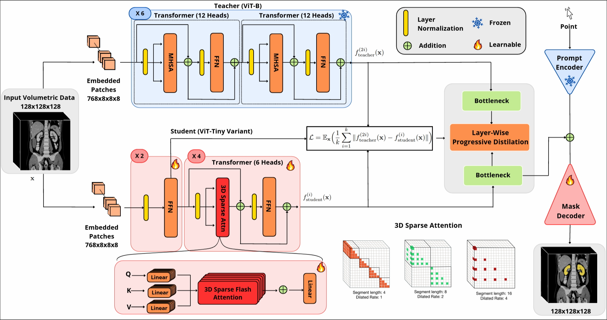
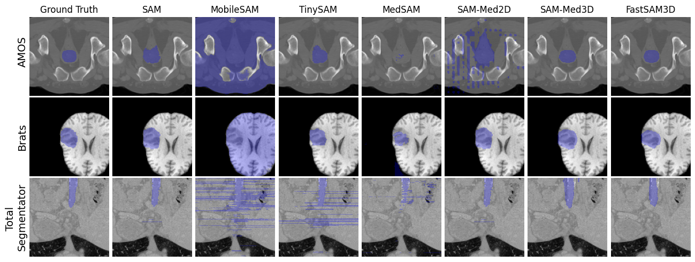

<p align="center">
    <h1 align="center">[MICCAI 2024] FastSAM3D: An Efficient Segment Anything Model for 3D Volumetric Medical Images </h1>
</p>
<div align="center">
  
</div>

## Update 
We have developed a 3D slicer extension for FastSAM3D and also SAMMed3D

link: https://github.com/arcadelab/FastSAM3D_slicer

## Overview

FastSAM3D is an efficient "Segment Anything Model" (SAM) designed for 3D volumetric medical images, aiming to achieve zero-shot generalization capability through interactive cues. The model significantly reduces inference time and computational cost through a novel layer-by-layer asymptotic distillation method and a 3D sparse lightning attention mechanism. FastSAM3D achieves inference on 128x128x128 volumetric images within 8 ms on NVIDIA A100 GPUs, which is 527.38x faster compared to 2D SAMs, and 8.75x faster than 3D SAMs while maintaining no significant performance degradation.

Link: https://arxiv.org/abs/2403.09827

---
## Features

- **High-Speed Inference**: Achieves rapid inference on 128x128x128 volumetric images in just 8 milliseconds when using an NVIDIA A100 GPU.
- **Cutting-Edge Model Efficiency**: Utilizes layer-wise progressive distillation to transfer knowledge from a 12-layer ViT-B to a more compact 6-layer ViT-Tiny, reducing model complexity without sacrificing performance.
- **Robust Performance**: Delivers competitive Dice scores across diverse datasets, demonstrating reliable segmentation results that are consistent with more computationally intensive models.
- **Interactivity**: Designed for interactive use, FastSAM3D allows for iterative user input to refine segmentation outputs, enhancing user engagement and control over the segmentation process.
- **Resource Efficiency**: Dramatically cuts down on computational costs with reduced FLOPs and memory usage, offering a significant speedup of 527.38× over 2D SAMs and 8.75× over 3D SAMs.


---

##  Repository Structure

```sh
└── FastSAM3D-v1/
    ├── =0.2.25
    ├── LICENSE
    ├── distillation.py
    ├── distillation.sh
    ├── infer.sh
    ├── infer_med2d.sh
    ├── infer_sam.sh
    ├── prepare_label.sh
    ├── preparelabel.py
    ├── requirements.txt
    ├── segment_anything
    │   ├── __init__.py
    │   ├── automatic_mask_generator.py
    │   ├── build_ls_sam3d.py
    │   ├── build_sam.py
    │   ├── build_sam3D.py
    │   ├── build_sam3D_decoder.py
    │   ├── build_sam3D_dilatedattention.py
    │   ├── build_sam3D_flash.py
    │   ├── modeling
    │   ├── predictor.py
    │   └── utils
    ├── sum_result.py
    ├── train.py
    ├── train.sh
    ├── train_unfreeze.py
    ├── train_unfreeze.sh
    ├── utils
    │   ├── click_method.py
    │   ├── data_loader.py
    │   ├── data_paths.py
    │   └── prepare_uunet.py
    ├── val_2d.py
    ├── validation.py
    └── validation_student.py
```

---

##  Getting Started

**System Requirements:**

* **Python**: `version 3.9 or above`
* **CUDA**: `version 12.1`
* **FLASH Attention support GPU**: `Ampere, Ada, or Hopper GPUs (e.g., A100, RTX 3090, RTX 4090, H100).`

###  Installation

<h4>From <code>source</code></h4>

> 1. Clone the FastSAM3D-v1 repository:
>
> ```console
> $ git clone https://github.com/skill-diver/FastSAM3D-v1
> ```
>
> 2. Change to the project directory:
> ```console
> $ cd FastSAM3D-v1
> ```
>
> 3. Install the dependencies:
> ```console
> $ pip install -r requirements.txt
> ```

###  Usage

<h4>From <code>source</code></h4>

> 1.Prepare Your Training Data (from nnU-Net-style dataset): 

> Ensure that your training data is organized according to the structure shown in the `data/medical_preprocessed` directories. The target file structures should be like the following:
> ```
> data/medical_preprocessed
>       ├── adrenal
>       │ ├── ct_WORD
>       │ │ ├── imagesTr
>       │ │ │ ├── word_0025.nii.gz
>       │ │ │ ├── ...
>       │ │ ├── labelsTr
>       │ │ │ ├── word_0025.nii.gz
>       │ │ │ ├── ...
>       ├── ...
> ```

> If the original data are in the **nnU-Net style**, follow these steps:
> 
> For a nnU-Net style dataset, the original file structure should be:
> ```
> Task010_WORD
>      ├── imagesTr
>      │ ├── word_0025_0000.nii.gz
>      │ ├── ...
>      ├── labelsTr
>      │ ├── word_0025.nii.gz
>      │ ├── ...
> ```
> > Then you should resample and convert the masks into binary. (You can use [script](https://github.com/arcadelab/FastSAM3D/blob/main/utils/prepare_uunet.py) for nnU-Net folder)
> ```
> data/train
>       ├── adrenal
>       │ ├── ct_WORD
>       │ │ ├── imagesTr
>       │ │ │ ├── word_0025.nii.gz
>       │ │ │ ├── ...
>       │ │ ├── labelsTr
>       │ │ │ ├── word_0025.nii.gz (binary label)
>       │ │ │ ├── ...
>       ├── liver
>       │ ├── ct_WORD
>       │ │ ├── imagesTr
>       │ │ │ ├── word_0025.nii.gz
>       │ │ │ ├── ...
>       │ │ ├── labelsTr
>       │ │ │ ├── word_0025.nii.gz (binary label)
>       │ │ │ ├── ...
>       ├── ...
> ```

> Then, modify the `utils/data_paths.py` according to your own data.
> ```
> img_datas = [
> "data/train/adrenal/ct_WORD",
> "data/train/liver/ct_WORD",
> ...
> ]
> ```


> 2. **Train the Teacher Model and Prepare Labels(logits)**
>
>    Use the command below to train the teacher model and prepare labels for guided distillation to the student model, and put your data and checkpoint in the corresponding position of the shell script:
>    ```console
>    $ ./preparelabel.sh
>    ```
>
> 3. **Distill the Model**
>
>    To distill the model, run the following command. The distilled checkpoint will be stored in `work_dir`, and put your data and checkpoint in the corresponding position of shell script:
>    ```console
>    $ ./distillation.sh
>
>    ```
>
> 4. **Validate the Teacher Model**
>
>    Validate the teacher model using the command below, and put your data and checkpoint in the corresponding position of shell script:
>    ```console
>    $ ./infer.sh
>    ```
>
> 5. **Validate the Student Model**
>
>    Finally, to validate the student model after distillation, and put your data and checkpoint in the corresponding position of the shell script:
>    ```console
>    $ ./validation_student.sh
>    ```


## Checkpoint

Below are the links to the checkpoints for FastSAM3D and its fine-tuned version:

| Model                | Download Link |
|----------------------|---------------|
| Tiny image encoder checkpoint of FASTSAM3D   | [Download](https://drive.google.com/file/d/1-rvRh1VYeBSWmAqNUS-9lKomtiaNXCL8/view?usp=sharing) |
| Finetuned-SAMMED3D  | [Download](https://drive.google.com/file/d/1bL-Q1zxYGwjBylnC9QmXRL-WhST3ti2T/view?usp=sharing) |
| FASTSAM3D            | [Download](https://drive.google.com/uc?export=download&id=1vmtqWzERvnGVwZVSSMpw_fE0zGHL_4QP) |

---
##  Visualize
<div align="center">
  
</div>
##  Contributing

Contributions are welcome! Here are several ways you can contribute:

- **[Report Issues](https://github.com/skill-diver/FastSAM3D-v1/issues)**: Submit bugs found or log feature requests for the `FastSAM3D-v1` project.
- **[Submit Pull Requests](https://github.com/skill-diver/FastSAM3D-v1/blob/main/CONTRIBUTING.md)**: Review open PRs, and submit your own PRs.
- **[Join the Discussions](https://github.com/skill-diver/FastSAM3D-v1/discussions)**: Share your insights, provide feedback, or ask questions.

<details closed>
<summary>Contributing Guidelines</summary>

1. **Fork the Repository**: Start by forking the project repository to your github account.
2. **Clone Locally**: Clone the forked repository to your local machine using a git client.
   ```sh
   git clone https://github.com/skill-diver/FastSAM3D-v1
   ```
3. **Create a New Branch**: Always work on a new branch, giving it a descriptive name.
   ```sh
   git checkout -b new-feature-x
   ```
4. **Make Your Changes**: Develop and test your changes locally.
5. **Commit Your Changes**: Commit with a clear message describing your updates.
   ```sh
   git commit -m 'Implemented new feature x.'
   ```
6. **Push to github**: Push the changes to your forked repository.
   ```sh
   git push origin new-feature-x
   ```
7. **Submit a Pull Request**: Create a PR against the original project repository. Clearly describe the changes and their motivations.
8. **Review**: Once your PR is reviewed and approved, it will be merged into the main branch. Congratulations on your contribution!
</details>

<details closed>
<summary>Contributor Graph</summary>
<br>
<p align="center">
   <a href="https://github.com{/skill-diver/FastSAM3D-v1/}graphs/contributors">
      
   </a>
</p>
</details>

---

##  License

This project is protected under the [Apache 2.0 license](LICENSE). 

---

## Citation

```
@misc{shen2024fastsam3d,
      title={FastSAM3D: An Efficient Segment Anything Model for 3D Volumetric Medical Images}, 
      author={Yiqing Shen and Jingxing Li and Xinyuan Shao and Blanca Inigo Romillo and Ankush Jindal and David Dreizin and Mathias Unberath},
      year={2024},
      eprint={2403.09827},
      archivePrefix={arXiv},
      primaryClass={eess.IV}
}
```
---

##  Acknowledgement
- Thanks to the open-source of the following projects:
  - [Segment Anything](https://github.com/facebookresearch/segment-anything) &#8194;
  - [SAM-Med3D](https://github.com/uni-medical/SAM-Med3D)

---
